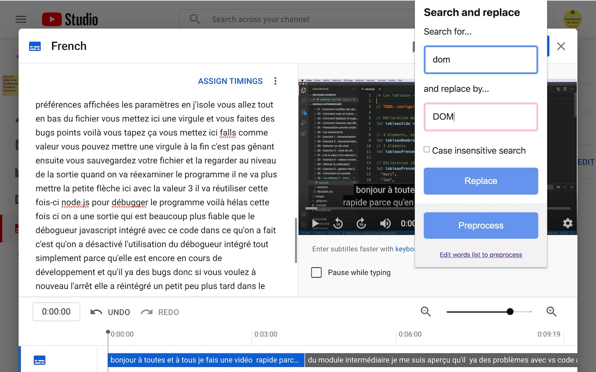

# Find and replace for YouTube subtitles (Chrome extension)

This is the official repository of the Chrome extension [Find and replace for YouTube subtitles](https://chrome.google.com/webstore/detail/idjehecnhghbndalgpfmhahnhkcfeeie/).

# Detailed description

Fix all misspelled words and expressions of YouTube transcripts (subtitles) right from the online YouTube editor with one single click.

Create your own personal list of misspelled words that must be replaced in your video and process them all with one click: huge time saver!

This extension works only when you are on the official online YouTube subtitle editor website.

# How does it works?

1. Log yourself into YouTube
2. Open YouTube Studio
3. Select the "Subtitles" category on the left panel
4. Select the video you want to edit the subtitles from
(at this step the URL should start by https://studio.youtube.com/channel/<your_channel_ID>/translations or https://studio.youtube.com/video/<your_channel_ID>/translations)
5. Click on the "edit" or "duplicate and edit" button next to the subtitle you want to edit
6. **WARNING: You MUST use the mode "edit as text" for the extension to work properly. So tap on this button in order to put the entire text of subtitles in one big block of text. That way the extension can search and replace in the whole text otherwise it will modify only a part of the text that is currently displayed in the interface.**
7. You can now use this extension, enjoy!

# Keyboard shortcuts
- Open the extension panel with CTRL+SHIFT+F
- Click on the first word of a sentence, tap twice on CTRL to create the start of a sentence

# You want to contribute?
Just submit a pull request, I'll be happy to review it and integrate it 😃. Thanks!
